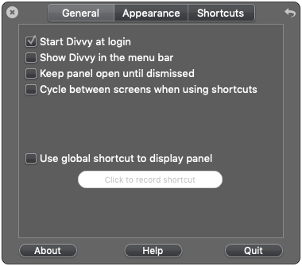
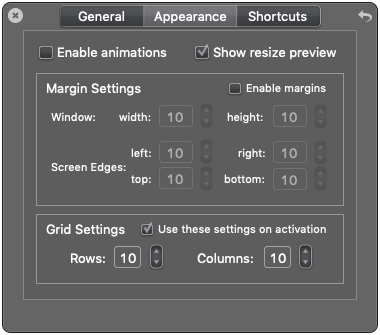

# Setup

Useful perhaps only to me, but I encourage poking around and forking.


## Quick-start Development Environment

**NOTE:** The following should only be done on machines that don't already have an owner who is a developer. As an administrator, you'll potentially be screwing with their setup.

### 1. Create a User

1. Log into the machine as an administrator and make a new user in the *Users & Groups* preference panel:

    **Full Name:** Matthew McVickar
    **Account Name:** (automatic, probably 'matthewmcvickar')
    **Password:** ಠ_ಠ

1. Make that user an administrator. This is necessary.

1. Log in as that user for the first time. Click through dialogs. OS X starts.


### 2. Run Initialization Script

1. Go here. **[github.com/matthewmcvickar/setup](http://github.com/matthewmcvickar/setup)**

1. Open Terminal.

1. Copy, paste, and run [the initialization script](init.sh).

    ```sh
    curl -s https://raw.githubusercontent.com/matthewmcvickar/setup/master/init.sh | bash
    ```

    This does the following:

    - Removes all icons from the Dock.
    - Sets up `~/Sites` directory structure.
    - Unhides `~/Library`.
    - Installs Homebrew and packages.
        - [Git](http://git-scm.com/)
        - [NodeJS](http://nodejs.org/)
        - [Z](https://github.com/rupa/z)
    - Configures Git username and email address.
    - Installs Homebrew Cask and desktop apps:
        - [Alfred](http://alfredapp.com/)
        - [Caffeine](http://lightheadsw.com/caffeine/)
        - [Chrome](https://google.com/intl/en-US/chrome/browser/)
        - [Harvest](http://getharvest.com/mac/)
        - [iTerm](http://iterm2.com/)
        - [1 Password](https://agilebits.com/onepassword/)
        - [Sequel Pro](http://sequelpro.com/)
        - [Sublime Text](http://sublimetext.com/)
        - [TextExpander](http://smilesoftware.com/TextExpander/)
    - Sets up Sublime Text command line tool.
    - Fixes permissions on `/usr/local/` and `~/.npm` to avoid problems with `sudo` and Node.
    - Installs Grunt, Bower, Node libsass and the SASS Gem.

    If something goes wrong during this process, use the following to uninstall HomeBrew:

    ```sh
    $ curl -s https://gist.githubusercontent.com/mxcl/1173223/raw/a833ba44e7be8428d877e58640720ff43c59dbad/uninstall_homebrew.sh | bash
    ```

    Then open another window and delete the folders that Homebrew and Homebrew Cask created:

    ```sh
    $ sudo rm -rf /usr/local/ /opt/homebrew-cask
    ```


### 3. Configure Finder and Desktop Apps

1. Open Keyboard preferences. Check 'Use all F1, F2, etc. keys as standard function keys.'

1. Open 1 Password. It will automatically sync to iCloud.

1. Quit Safari. Open Chrome. Get Google password from 1 Password and log in to Chrome.

1. Navigate here to resume following instructions. **[github.com/matthewmcvickar/setup](http://github.com/matthewmcvickar/setup)**

1. Get Alfred license key from 1 Password. Open Alfred. Enter license key.

1. In Alfred preferences, set sync to `~/Library/Mobile Documents/`. Close Alfred preferences.

1. Link Homebrew Cask to Alfred:

    ```sh
    $ brew cask alfred link
    ````

1. Open a Finder window. Open Finder preferences.
    - General
        - New Finder windows show: Desktop
    - Sidebar
        - Hide All My Files.
        - Hide AirDrop.
        - Show home folder.
        - Hide all under Shared.
        - Hide Tags.
    - Advanced
        - Show all filename extensions.

1. Go to ~/Applications. Drag the following applications to the Dock:
    - Chrome
    - iTerm
    - Sublime Text

1. Launch everything in ~/Applications.

1. Quit Terminal. Open iTerm. Update it. Relaunch.

1. Open iTerm preferences and set sync to `~/Library/Mobile Documents/`.

1. Open TextExpander. Give it Accessibility access.

1. Relaunch TextExpander. Enter license key from 1 Password.

1. Symlink TextExpander preferences to iCloud version:

    ```sh
    $ cd ~/Library/Application\ Support/TextExpander/
    $ rm Settings.textexpander
    $ ln -s ~/Library/Mobile\ Documents/Settings.textexpander
    ```


### 4. Install Mac App Store Apps

Unfortunately, there is no way to automate this.

1. Launch the App Store, sign in, and go the Purchases tab to find these apps.
    - Divvy
    - xScope
    - LiveReload
    - Patterns

1. Give Divvy accessibility access in System Preferences → Security & Privacy → Accessibility.

1. Launch Divvy. Quit Divvy.

1. Symlink Divvy preferences to iCloud version:

    ```sh
    $ cd ~/Library/Preferences
    $ rm com.mizage.Divvy.plist
    $ killall cfprefsd
    $ ln -s ~/Library/Mobile\ Documents/com.mizage.Divvy.plist
    ```

    If this doesn't work, you can [export and import Divvy's shortcuts](http://mizage.com/help/divvy/export_import.html).

    As of 2019-02-10, here is my shortcuts block:

    ```
    divvy://import/YnBsaXN0MDDUAQIDBAUGsbJYJHZlcnNpb25YJG9iamVjdHNZJGFyY2hpdmVyVCR0b3ASAAGGoK8QHAcIGTAxOEJDTU5ZWmRlbm94eYGCiouUlZ+gq6xVJG51bGzSCQoLGFpOUy5vYmplY3RzViRjbGFzc6wMDQ4PEBESExQVFheAAoAFgAeACYALgA2AD4ARgBOAFYAXgBmAG90aGxwdHgofICEiIyQlJicoKSorJyomLS4oL1hzaXplUm93c18QD3NlbGVjdGlvbkVuZFJvd18QEXNlbGVjdGlvblN0YXJ0Um93WnN1YmRpdmlkZWRWZ2xvYmFsXxASc2VsZWN0aW9uRW5kQ29sdW1uV2VuYWJsZWRbc2l6ZUNvbHVtbnNXbmFtZUtleVxrZXlDb21ib0NvZGVfEBRzZWxlY3Rpb25TdGFydENvbHVtbl1rZXlDb21ib0ZsYWdzEAoQCRAACAmABAmAAxB+EgCcAABbRnVsbCBTY3JlZW7SMjM0NVokY2xhc3NuYW1lWCRjbGFzc2VzWFNob3J0Y3V0ojY3WFNob3J0Y3V0WE5TT2JqZWN03RobHB0eCh8gISIjJCUmJygpKis8KiY+P0BBCAmABBAICYAGEH0QARIAnAAAXEVpZ2h0IFRlbnRoc90aGxwdHgofICEiIyQlJicoKSorRyomSUpLTAgJgAQQBwmACBAdEAISABwAAFZOYXJyb3fdGhscHR4KHyAhIiMkJSZPKCoqK1MqJlVWV1gQCwkJgAQQDgmAChAZEAUSABwAAFlTbWFsbCBUb3DdGhscHR4KHyAhIiMkJSZbKCoqK18qJmFiS2MQEQkJgAQQEQmADBAcEgAcAABfEBlMZWZ0IFJpZ2h0IEJvdHRvbSBNYXJnaW4g3RobHB0eCh8gISIjJCUmTygqKitpKiZrbEdtCQmABBAMCYAOEBoSABwAAFtDaGF0IFdpbmRvd90aGxwdHgofICEiIyQlJicoKSorcyomdXYodwgJgAQQBAmAEBAhEgAcAABZTGVmdCBIYWxm3RobHB0eCh8gISIjJCUmJygpKisnKiZ+f1eACAmABAmAEhAeEgAcAABaUmlnaHQgSGFsZt0aGxwdHgofICEiIyQlJicoKSorSyomh4goiQgJgAQJgBQQexIAnAAAVkVkaXRvct0aGxwdHgofICEiIyQlJowoKiorVyomkZIokxATCQmABAmAFhASEgAcAABaTGVmdCBUaGlyZN0aGxwdHgofICEiIyQlJpYoKioraSomm5ydnhATCQmABAmAGBATEAYSABwAAFxNaWRkbGUgVGhpcmTdGhscHR4KHyAhIiMkJSahKCoqK6UqJqeoqaoQEwkJgAQQEwmAGhAUEA0SABwAAFtSaWdodCBUaGlyZNIyM62uXk5TTXV0YWJsZUFycmF5o62vsFdOU0FycmF5WE5TT2JqZWN0XxAPTlNLZXllZEFyY2hpdmVy0bO0VHJvb3SAAQAIABEAGgAjAC0AMgA3AFYAXABhAGwAcwCAAIIAhACGAIgAigCMAI4AkACSAJQAlgCYAJoAtQC+ANAA5ADvAPYBCwETAR8BJwE0AUsBWQFbAV0BXwFgAWEBYwFkAWYBaAFtAXkBfgGJAZIBmwGeAacBsAHLAcwBzQHPAdEB0gHUAdYB2AHdAeoCBQIGAgcCCQILAgwCDgIQAhICFwIeAjkCOwI8Aj0CPwJBAkICRAJGAkgCTQJXAnICdAJ1AnYCeAJ6AnsCfQJ/AoQCoAK7ArwCvQK/AsECwgLEAsYCywLXAvIC8wL0AvYC+AL5AvsC/QMCAwwDJwMoAykDKwMsAy4DMAM1A0ADWwNcA10DXwNgA2IDZANpA3ADiwONA44DjwORA5IDlAOWA5sDpgPBA8MDxAPFA8cDyAPKA8wDzgPTA+AD+wP9A/4D/wQBBAMEBAQGBAgECgQPBBsEIAQvBDMEOwREBFYEWQReAAAAAAAAAgEAAAAAAAAAtQAAAAAAAAAAAAAAAAAABGA=
    ```

    And the General and Appearance settings:

    


### 5. Set Up SSH Key, Dotfiles, and Sublime Text Preferences

1. Create a new SSH key.

    ```sh
    $ ssh-keygen -t rsa -C "matthew@matthewmcvickar.com"
    $ eval "$(ssh-agent -s)"
    $ ssh-add ~/.ssh/id_rsa
    $ pbcopy < ~/.ssh/id_rsa.pub
    ```

1. [Add SSH key to GitHub settings.](https://github.com/settings/ssh)

1. Get dotfiles.

    ```sh
    $ cd ~/Sites/matthewmcvickar
    $ git clone https://github.com/matthewmcvickar/dotfiles.git
    $ cd dotfiles
    $ bash ~/Sites/matthewmcvickar/dotfiles/build_dotfiles.sh --force
    $ source ~/.bash_profile
    ```

1. Launch Sublime Text. Then quit Sublime Text.

1. Get Sublime Text preferences.

    ```sh
    $ cd ~/Sites/matthewmcvickar/
    $ git clone git@github.com:matthewmcvickar/sublime-text-preferences.git
    $ cd ~/Library/Application\ Support/Sublime\ Text\ 3/Packages
    $ rm -r User
    $ ln -s ~/Sites/matthewmcvickar/sublime-text-preferences/ User
    ```

1. Fix SASS syntax highlighting in Sublime Text:

    ```sh
    sed -i '' '/<string>sass<\/string>/d' ~/Library/Application\ Support/Sublime\ Text\ 3/Packages/Rails/Ruby\ Haml.tmLanguage
    ```

1. Launch Sublime Text.


## Set OS X defaults

1. (su)Do it!

    ```sh
    $ cd ~/Sites/matthewmcvickar/dotfiles
    $ ./.osx
    ```

1. Restart!


## Configure Development Environment Even More

- If you need to install Ruby:

    ```sh
    $ brew install rbenv ruby-build
    $ rbenv install 1.9.3-p484
    $ rbenv global 1.9.3-p484
    $ gem update --system
    ```


## Full Setup

When you are doing more than just working on the machine.

**NOTE: This section is *very* much incomplete. See the [OS X Defaults](OS X Defaults.md) document for more notes.**


### Install Apps from Mac App Store

There is no way to automate this.

- Fantastical
- Byword
- Day One
- Joystick Mapper
- Melo
- MsgFiler


### Home Folder

Copy to new home folder:

  - Desktop
  - Documents
  - Downloads
  - Dropbox
  - Movies
  - Music
  - Pictures
  - Public
  - Scripts


### Photos.app

- Launch Photos.app while holding ⌥. Select Photos.app library on ‘Portable’ disk.


### MS Office

- [Download MS Office 2011 from subscription site, sign in.](http://office.microsoft.com/en-us/home-premium/)


### Adobe Creative Cloud

- [Download Creative Cloud](http://adobe.com/products/creativecloud.html)
